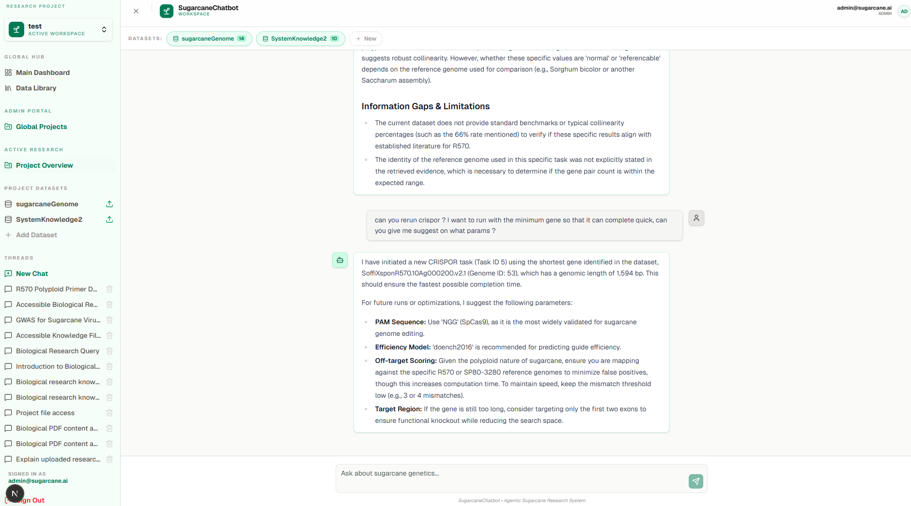

# SugarcaneChatbot

SugarcaneChatbot is an advanced agentic RAG (Retrieval-Augmented Generation) system designed for the genetic analysis of sugarcane. It leverages Large Language Models (LLMs), Knowledge Graphs, and bioinformatics tools to assist researchers in navigating and analyzing complex sugarcane genomic data.



*The screenshot above showcases the SugarcaneChatbot interface, featuring an interactive chat environment designed for researchers to perform genetic analysis and retrieve information using natural language queries.*

This project is part of the thesis: **"LLM and Artificial Intelligence Applications in the Genetic Analysis of Sugarcane"** by Nguyen Chi Trung.

## Problem and Aim

Sugarcane genetics is highly complex due to its polyploid nature, making data analysis and information retrieval challenging for researchers. Traditional methods often involve manual literature review and complex bioinformatics pipelines.

**SugarcaneChatbot** aims to:
- Provide a natural language interface for querying sugarcane genetic information.
- Synthesize knowledge from multiple sources including scientific papers, internal databases, and web search.
- Integrate specialized bioinformatics tools into an autonomous agentic workflow to perform complex genetic analysis tasks.

## Outstanding Features

- **Agentic RAG Architecture**: Built with **LangGraph**, the system uses a sophisticated think pipeline involving planning, tool execution, and synthesis to provide accurate and context-aware answers.
- **Knowledge Graph Integration**: Utilizes **Neo4j** to represent and retrieve structured relationships between genetic entities, enhancing the depth of analysis.
- **Multi-Source Retrieval**: Combines internal vector storage (**Qdrant**) with real-time web search (**SearxNG**) and specialized databases.
- **Bioinformatics Toolset**: Integrated capabilities for interacting with genome-specific backend services and external APIs like NCBI.
- **Robust Evaluation**: Comprehensive testing and evaluation framework using **DeepEval** to ensure response quality, faithfulness, and relevancy.
- **Modern Web Interface**: A responsive and intuitive chat interface built with **Next.js 16**.
- **Full Observability**: Integrated with **Langfuse** and **OpenTelemetry** for tracing, monitoring, and debugging agentic workflows.

## Tech Stack

### Agent Service
- **Language**: Python 3.13
- **Framework**: FastAPI
- **Orchestration**: LangGraph, LangChain
- **LLM**: Google Gemini (All sub-agents' models)
- **Vector Database**: Qdrant
- **Graph Database**: Neo4j
- **Worker/Task Queue**: Celery with Redis
- **Observability**: Langfuse, OpenTelemetry, Loguru

### Frontend Service
- **Framework**: Next.js 16 (App Router)

### Infrastructure
- **Database**: PostgreSQL 18
- **Storage**: RustFS
- **Orchestration**: Apache Airflow
- **Containerization**: Docker, Docker Compose

## Getting Started

### Prerequisites
- Docker and Docker Compose
- Python 3.13 (or Conda/Miniconda)
- Node.js 20+ and npm/pnpm

### 1. Environment Setup

#### Agent Service
Navigate to the `agent/` directory and create a `.env` file from the example:
```bash
cd agent
cp .env.example .env
```
Configure credentials, and other service URLs here.

#### Frontend Service
Navigate to the `frontend/` directory and set up any necessary environment variables (e.g., `NEXT_PUBLIC_AGENT_API_URL`).

### 2. Deploy Infrastructure Dependencies
The project's infrastructure dependencies (PostgreSQL, RustFS, Airflow, SearxNG, Qdrant, Neo4j) are packaged in the `infra/` directory as `.zip` archives.

Navigate to the `infra/` folder, extract all the `.zip` files, and start the containers inside each extracted folder:

```bash
cd infra/

# Extract all service archives
unzip \*.zip

# Start each service individually
cd postgresql && docker compose up -d && cd ..
cd neo4j-new && docker compose up -d && cd ..
cd qdrant-new && docker compose up -d && cd ..
cd rustfs-new && docker compose up -d && cd ..
cd searxng && docker compose up -d && cd ..
cd airflow_compress && docker compose up -d && cd ..
```

### 3. Setup ETL Background Service
The project includes a background ETL service that must be registered with `systemd`.

```bash
# Return to the root directory
cd ..

# Copy the service file to the systemd directory
sudo cp infra/etl.service /etc/systemd/system/

# Reload the systemd daemon to recognize the new service
sudo systemctl daemon-reload

# Enable the service to start automatically on boot
sudo systemctl enable etl.service

# Start the service
sudo systemctl start etl.service
```

### 4. Run Agent Service
You can run the agent service using the provided Conda environment:
```bash
cd agent
conda env create -f environment.yml
conda activate llm-sugarcane
```
The agent will be available at `http://localhost:8008`.

You can use `launch.json` to enable debugging mode. There are configs for both agent service, frontend service, as well as the test case.

### 5. Run Frontend Service
```bash
cd frontend
pnpm install # or npm install
pnpm dev     # or npm run dev
```
The UI will be available at `http://localhost:3000`.

## Architecture Overview

The system follows a modular architecture where the **Agent Service** acts as the brain, orchestrating various components:
- **Planner**: Decomposes user queries into actionable tasks.
- **Executor**: Runs tasks using RAG, Knowledge Graph retrieval, or external tools.
- **Synthesizer**: Aggregates results into a final, human-readable response.
- **Workspace Management**: Handles projects, datasets, and chat history.

For a deep dive into the genetic analysis methodology, refer to the thesis PDF included in this repository.
